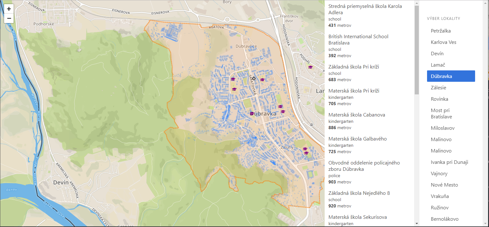

# Overview

Tato aplikacia ukazuje obydlia v Bratislave na mape.
Najdolezitejsie vlastnosti:
- zobrazenie hranic mestskych casti
- vyber obydli podla mestskej casti
- najdenie zaujimavych bodov (policia, nemocnice, skola, skolky) pre rodinu v okoli 5 km (hodina peso) od vybraneho obydlia (klik)
- zobrazenie tychto bodov na mape a v zozname zoradene podla vzdialenosti 

Takto to vyzera:

Aplikacia ma 3 casti:
- front-end klient: LeafletJS, React
- back-end server: HapiJS (NodeJS framework)
- PostGIS docker kontainer

# Frontend

Frontend aplikacia je napisana v Javascriptovej kniznici ReactJS. 
Vyuzitim React.ContextProvider riesime manazment stavu v aplikacii a pristup k Leaflet.Map objektu.
Zaujmovy bod ma ikonku podla svojho typu, tieto ikonky su ako Leaflet.DivIcon s pouzitim Font Awesome Icons, kazdy bod ma roznu farbu pre odlisenie.

Kod pre frontend je v priecinku `Client/src` a je rozdeleny na komponenty App, Map, MapContext a RightMenu.

Kroky pre spustenie:
- install NodeJS 8
- `cd client`
- `npm install && npm run dev`
- v okne prehliadaca sa otvori klient 

# Backend

Backend je napisany v NodeJS frameworku HapiJS a riesi dopytovanie PostGIS serveru.

## Data

Ziskal som data z Open Street Maps, stiahol som vysek Bratislavy a jej okolia. Importoval som data pomocou `osm2pgsql` s prepinacom `-l` pre lat lon koordinaty a pouzivanie geography typu nad stlpcom `way`. Geography typ mi viac vyhovoval, nebolo potrebne pretypovavat a konvertovat z lat lon na Web Mercator a vice versa.

Vystavene API je v subore `server/src/main.js` a v subore `server/src/query.js` sa nachadzaju PostgreSQL dopyty.

GeoJSON som negeroval iba pomocou `st_asgeojson`, ale vyuzil som PostgreSQL `json_build_object` pre generovanie korektneho GeoJSON-u, teda naagregovanie `features` do `featureCollection`, na backende a frontende nie je potom potrebny preprocessing.
